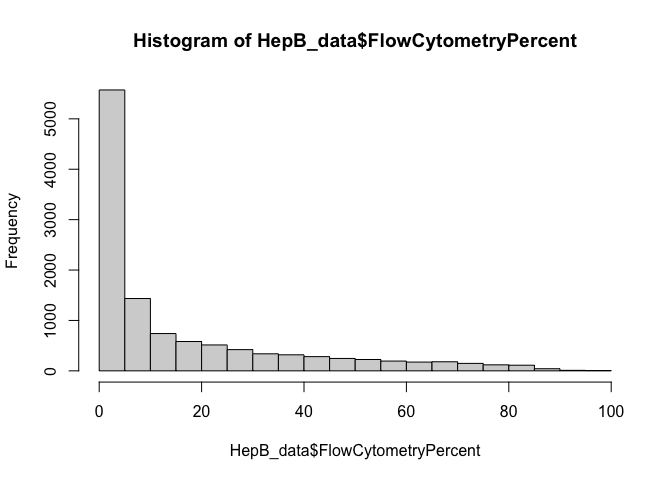

Applying MOFA to the Hepatitis B vaccine datasets
================
true
2024-04-08

- [Introduction](#introduction)
- [Load libraries](#load-libraries)
- [Load Omic datasets](#load-omic-datasets)
  - [mRNA expression](#mrna-expression)
  - [Flow cytometry](#flow-cytometry)
  - [Cytokines/Chemokines](#cytokineschemokines)
  - [Sample metadata](#sample-metadata)
- [Create the MOFA object and train the
  model](#create-the-mofa-object-and-train-the-model)
  - [Plot data overview](#plot-data-overview)
  - [Define MOFA options](#define-mofa-options)
  - [Train the MOFA model](#train-the-mofa-model)
  - [Add sample metadata to the
    model](#add-sample-metadata-to-the-model)
  - [Variance decomposition analysis](#variance-decomposition-analysis)
- [Characterisation of Factor 2](#characterisation-of-factor-2)
  - [Association analysis](#association-analysis)
  - [Inspection of factor values](#inspection-of-factor-values)
  - [Inspection of feature weights](#inspection-of-feature-weights)
- [Prediction of individual markers for personalised treatment based on
  the patient’s IGHV
  status](#prediction-of-individual-markers-for-personalised-treatment-based-on-the-patients-ighv-status)
- [Characterisation of Factor 3](#characterisation-of-factor-3)
- [Gene set enrichment analysis](#gene-set-enrichment-analysis)
  - [Read Hallmark gene set
    annotations.](#read-hallmark-gene-set-annotations)
  - [Run enrichment analysis](#run-enrichment-analysis)
  - [Plot enrichment analysis
    results](#plot-enrichment-analysis-results)
- [Customized analysis](#customized-analysis)
- [Building predictive models of diphteria
  response](#building-predictive-models-of-diphteria-response)
- [Solutions](#solutions)
- [sessionInfo](#sessioninfo)

# Introduction

The study includes 174 participants that received three vaccines a dual
Hepatitis A/B vaccine, a dual diphteria and tetanus and a vaccine
against cholera. Blood samples were collected before vaccination and 7
days after the first immunization. Blood samples were profilled by
microarray (Affymetrix array), flow cytometry, cytokines/chemokines
profiling in plasma. Further details on the datasets can be found in
this [article](https://www.nature.com/articles/ncomms10369). Today you
are going to use datasets only at the prevaccination time point and
determine if any multi-Omic factor is associated with response to
vaccination.

# Load libraries

Make sure that you have installed the
[MOFA2](https://github.com/bioFAM/MOFA2#installation) package.

``` r
suppressPackageStartupMessages(library(package = "MOFA2"))
suppressPackageStartupMessages(library(package = "psych"))
suppressPackageStartupMessages(library(package = "fgsea"))
suppressPackageStartupMessages(library(package = "knitr"))
suppressPackageStartupMessages(library(package = "ggpubr"))
suppressPackageStartupMessages(library(package = "tidyverse"))
```

# Load Omic datasets

Data is stored as a list of matrices. Features are stored in the rows
and samples in the columns

``` r
load(file = "HepB_data.RData")
lapply(HepB_data,dim)
```

    ## $mRNA
    ## [1] 22580   174
    ## 
    ## $Cytokines_Chemokines
    ## [1]  47 174
    ## 
    ## $FlowCytometryCount
    ## [1]  17 174
    ## 
    ## $FlowCytometryPercent
    ## [1]  67 174

## mRNA expression

The mRNA expression has been quantile normalized using the function
affy::rma
(<https://bioconductor.org/packages/release/bioc/html/affy.html>). The
top 5000 most varying genes are provided.

``` r
hist(HepB_data$mRNA)
```

<!-- -->

## Flow cytometry

Absolute counts and relative frequencies of the main immune cells in
blood.

``` r
hist(HepB_data$FlowCytometryCount)
```

<!-- -->

``` r
hist(HepB_data$FlowCytometryPercent)
```

<!-- -->

## Cytokines/Chemokines

Cytokines and Chemokines protein levels in plasma measured by an
multiplex ELISA.

``` r
hist(HepB_data$Cytokines_Chemokines)
```

<!-- -->

## Sample metadata

Read sample metadata provided as a CSV file. Important columns are: -
**age**: age in years - **gender**: sex of the participant F (female), M
(male) - **hepatitis b average concentration (pre-vax)**:
HepatitisB-specific antibody titers pre-vaccination - **hepatitis b
average concentration (post-vax)**: Antibody titers 1 month after the
2nd immunization with the HepB vaccine

``` r
HepB_metadata <- read_csv("HepB_metadata.csv", show_col_types = FALSE)

head(HepB_metadata) %>%
  kable()
```

| donor | sample       | tissue | vaccination time | visit number | Diphtheria Average Concentration (unit) | Diphtheria Average Concentration (pre-vax) | Diphtheria Average Concentration (post-vax) | Tetanus Average Concentration (unit) | Tetanus Average Concentration (pre-vax) | Tetanus Average Concentration (post-vax) | Hepatitis B Average Concentration (unit) | Hepatitis B Average Concentration (pre-vax) | Hepatitis B Average Concentration (post-vax) | Cholera Normalized Titer (unit) | Cholera Normalized Titer (pre-vax) | Cholera Normalized Titer (post-vax) | age | gender | ht_cnt | wt_klg |
|------:|:-------------|:-------|:-----------------|:-------------|:----------------------------------------|:-------------------------------------------|:--------------------------------------------|:-------------------------------------|:----------------------------------------|:-----------------------------------------|:-----------------------------------------|:--------------------------------------------|:---------------------------------------------|:--------------------------------|:-----------------------------------|:------------------------------------|----:|:-------|-------:|-------:|
|  1001 | NIML_1001_V2 | Blood  | pre-vaccination  | V2           | IU/mL                                   | 0.165                                      | 1.45                                        | IU/mL                                | 4.808                                   | 16.892                                   | mIU/mL                                   | \<5                                         | 34.882                                       | 1/dilution factor               | \<40                               | 575.1635369                         |  73 | F      |  162.5 |   60.6 |
|  1004 | NIML_1004_V2 | Blood  | pre-vaccination  | V2           | IU/mL                                   | \<0.1                                      | 0.172                                       | IU/mL                                | 3.809                                   | 3.945                                    | mIU/mL                                   | \<5                                         | \<5                                          | 1/dilution factor               | \<40                               | 3364.751139                         |  70 | M      |  171.5 |   73.6 |
|  1005 | NIML_1005_V2 | Blood  | pre-vaccination  | V2           | IU/mL                                   | 3.768                                      | 4.161                                       | IU/mL                                | 19.416                                  | 20.715                                   | mIU/mL                                   | \<5                                         | 5.072                                        | 1/dilution factor               | \<40                               | \<40                                |  70 | F      |  154.5 |   55.4 |
|  1006 | NIML_1006_V2 | Blood  | pre-vaccination  | V2           | IU/mL                                   | \<0.1                                      | 2.004                                       | IU/mL                                | \<0.1                                   | 8.955                                    | mIU/mL                                   | \<5                                         | \<5                                          | 1/dilution factor               | \<40                               | \<40                                |  67 | F      |  148.0 |   58.1 |
|  1007 | NIML_1007_V2 | Blood  | pre-vaccination  | V2           | IU/mL                                   | \<0.1                                      | 2.104                                       | IU/mL                                | \<0.1                                   | 21.465                                   | mIU/mL                                   | \<5                                         | 6.738                                        | 1/dilution factor               | \<40                               | 260.7956731                         |  67 | F      |  164.0 |   76.2 |
|  1008 | NIML_1008_V2 | Blood  | pre-vaccination  | V2           | IU/mL                                   | \<0.1                                      | 0.312                                       | IU/mL                                | \<0.1                                   | 0.266                                    | mIU/mL                                   | \<5                                         | \<5                                          | 1/dilution factor               | \<40                               | \<40                                |  68 | F      |  169.0 |   63.9 |

# Create the MOFA object and train the model

Create the MOFA object

``` r
MOFAobject <- create_mofa(HepB_data)
MOFAobject
```

    ## Untrained MOFA model with the following characteristics: 
    ##  Number of views: 4 
    ##  Views names: mRNA Cytokines_Chemokines FlowCytometryCount FlowCytometryPercent 
    ##  Number of features (per view): 22580 47 17 67 
    ##  Number of groups: 1 
    ##  Groups names: group1 
    ##  Number of samples (per group): 174 
    ## 

## Plot data overview

Visualise the number of views (rows) and the number of groups (columns)
exist, what are their corresponding dimensionalities and how many
missing information they have (grey bars).

``` r
plot_data_overview(MOFAobject)
```

<!-- -->

## Define MOFA options

### Model options

Two important options: - **num_factors**: number of factors -
**likelihoods**: likelihood per view (options are “gaussian”, “poisson”,
“bernoulli”). By default the “gaussian” distribution is used. When
having binary data one should change the likelihood to “bernoulli”.
mutations, one should change the likelihood to “bernoulli”:

``` r
model_opts <- get_default_model_options(MOFAobject)
model_opts$num_factors <- 15
model_opts
```

    ## $likelihoods
    ##                 mRNA Cytokines_Chemokines   FlowCytometryCount 
    ##           "gaussian"           "gaussian"           "gaussian" 
    ## FlowCytometryPercent 
    ##           "gaussian" 
    ## 
    ## $num_factors
    ## [1] 15
    ## 
    ## $spikeslab_factors
    ## [1] FALSE
    ## 
    ## $spikeslab_weights
    ## [1] FALSE
    ## 
    ## $ard_factors
    ## [1] FALSE
    ## 
    ## $ard_weights
    ## [1] TRUE

## Train the MOFA model

Prepare the MOFA object

``` r
MOFAobject <- prepare_mofa(MOFAobject, model_options = model_opts)
```

``` r
set.seed(seed = 42)
MOFAobject <- run_mofa(MOFAobject)
```

    ## 
    ##         #########################################################
    ##         ###           __  __  ____  ______                    ### 
    ##         ###          |  \/  |/ __ \|  ____/\    _             ### 
    ##         ###          | \  / | |  | | |__ /  \ _| |_           ### 
    ##         ###          | |\/| | |  | |  __/ /\ \_   _|          ###
    ##         ###          | |  | | |__| | | / ____ \|_|            ###
    ##         ###          |_|  |_|\____/|_|/_/    \_\              ###
    ##         ###                                                   ### 
    ##         ######################################################### 
    ##        
    ##  
    ##         
    ## use_float32 set to True: replacing float64 arrays by float32 arrays to speed up computations...
    ## 
    ## Successfully loaded view='mRNA' group='group1' with N=174 samples and D=22580 features...
    ## Successfully loaded view='Cytokines_Chemokines' group='group1' with N=174 samples and D=47 features...
    ## Successfully loaded view='FlowCytometryCount' group='group1' with N=174 samples and D=17 features...
    ## Successfully loaded view='FlowCytometryPercent' group='group1' with N=174 samples and D=67 features...
    ## 
    ## 
    ## Warning: 22 features(s) in view 1 are full of missing values, please consider removing them before training the model...
    ## 
    ## Model options:
    ## - Automatic Relevance Determination prior on the factors: False
    ## - Automatic Relevance Determination prior on the weights: True
    ## - Spike-and-slab prior on the factors: False
    ## - Spike-and-slab prior on the weights: False
    ## Likelihoods:
    ## - View 0 (mRNA): gaussian
    ## - View 1 (Cytokines_Chemokines): gaussian
    ## - View 2 (FlowCytometryCount): gaussian
    ## - View 3 (FlowCytometryPercent): gaussian
    ## 
    ## 
    ## 
    ## 
    ## ######################################
    ## ## Training the model with seed 42 ##
    ## ######################################
    ## 
    ## 
    ## ELBO before training: -73399559.51 
    ## 
    ## Iteration 1: time=0.41, ELBO=-4467315.72, deltaELBO=68932243.787 (93.91370227%), Factors=15
    ## Iteration 2: time=0.42, Factors=15
    ## Iteration 3: time=0.42, Factors=15
    ## Iteration 4: time=0.42, Factors=15
    ## Iteration 5: time=0.46, Factors=15
    ## Iteration 6: time=0.42, ELBO=-761816.20, deltaELBO=3705499.519 (5.04839476%), Factors=15
    ## Iteration 7: time=0.45, Factors=15
    ## Iteration 8: time=0.48, Factors=15
    ## Iteration 9: time=0.48, Factors=15
    ## Iteration 10: time=0.49, Factors=15
    ## Iteration 11: time=0.49, ELBO=-709148.99, deltaELBO=52667.211 (0.07175412%), Factors=15
    ## Iteration 12: time=0.47, Factors=15
    ## Iteration 13: time=0.52, Factors=15
    ## Iteration 14: time=0.48, Factors=15
    ## Iteration 15: time=0.54, Factors=15
    ## Iteration 16: time=0.49, ELBO=-693273.45, deltaELBO=15875.543 (0.02162893%), Factors=15
    ## Iteration 17: time=0.58, Factors=15
    ## Iteration 18: time=0.52, Factors=15
    ## Iteration 19: time=0.53, Factors=15
    ## Iteration 20: time=0.58, Factors=15
    ## Iteration 21: time=0.57, ELBO=-686526.60, deltaELBO=6746.848 (0.00919195%), Factors=15
    ## Iteration 22: time=0.53, Factors=15
    ## Iteration 23: time=0.52, Factors=15
    ## Iteration 24: time=0.54, Factors=15
    ## Iteration 25: time=0.55, Factors=15
    ## Iteration 26: time=0.52, ELBO=-681751.74, deltaELBO=4774.864 (0.00650530%), Factors=15
    ## Iteration 27: time=0.56, Factors=15
    ## Iteration 28: time=0.53, Factors=15
    ## Iteration 29: time=0.51, Factors=15
    ## Iteration 30: time=0.52, Factors=15
    ## Iteration 31: time=0.53, ELBO=-678119.06, deltaELBO=3632.674 (0.00494918%), Factors=15
    ## Iteration 32: time=0.47, Factors=15
    ## Iteration 33: time=0.58, Factors=15
    ## Iteration 34: time=0.57, Factors=15
    ## Iteration 35: time=0.61, Factors=15
    ## Iteration 36: time=0.56, ELBO=-675585.91, deltaELBO=2533.153 (0.00345118%), Factors=15
    ## Iteration 37: time=0.51, Factors=15
    ## Iteration 38: time=0.63, Factors=15
    ## Iteration 39: time=0.56, Factors=15
    ## Iteration 40: time=0.62, Factors=15
    ## Iteration 41: time=0.55, ELBO=-673810.66, deltaELBO=1775.249 (0.00241861%), Factors=15
    ## Iteration 42: time=0.59, Factors=15
    ## Iteration 43: time=0.57, Factors=15
    ## Iteration 44: time=0.60, Factors=15
    ## Iteration 45: time=0.57, Factors=15
    ## Iteration 46: time=0.59, ELBO=-672467.25, deltaELBO=1343.406 (0.00183026%), Factors=15
    ## Iteration 47: time=0.63, Factors=15
    ## Iteration 48: time=0.60, Factors=15
    ## Iteration 49: time=0.57, Factors=15
    ## Iteration 50: time=0.54, Factors=15
    ## Iteration 51: time=0.57, ELBO=-671366.09, deltaELBO=1101.160 (0.00150023%), Factors=15
    ## Iteration 52: time=0.59, Factors=15
    ## Iteration 53: time=0.61, Factors=15
    ## Iteration 54: time=0.57, Factors=15
    ## Iteration 55: time=0.59, Factors=15
    ## Iteration 56: time=0.70, ELBO=-670408.12, deltaELBO=957.970 (0.00130514%), Factors=15
    ## Iteration 57: time=0.65, Factors=15
    ## Iteration 58: time=0.66, Factors=15
    ## Iteration 59: time=0.61, Factors=15
    ## Iteration 60: time=0.53, Factors=15
    ## Iteration 61: time=0.60, ELBO=-669543.76, deltaELBO=864.359 (0.00117761%), Factors=15
    ## Iteration 62: time=0.55, Factors=15
    ## Iteration 63: time=0.51, Factors=15
    ## Iteration 64: time=0.62, Factors=15
    ## Iteration 65: time=0.56, Factors=15
    ## Iteration 66: time=0.59, ELBO=-668747.65, deltaELBO=796.118 (0.00108464%), Factors=15
    ## Iteration 67: time=0.64, Factors=15
    ## Iteration 68: time=0.59, Factors=15
    ## Iteration 69: time=0.62, Factors=15
    ## Iteration 70: time=0.56, Factors=15
    ## Iteration 71: time=0.60, ELBO=-668009.85, deltaELBO=737.801 (0.00100518%), Factors=15
    ## Iteration 72: time=0.58, Factors=15
    ## Iteration 73: time=0.58, Factors=15
    ## Iteration 74: time=0.60, Factors=15
    ## Iteration 75: time=0.61, Factors=15
    ## Iteration 76: time=0.62, ELBO=-667326.27, deltaELBO=683.574 (0.00093131%), Factors=15
    ## Iteration 77: time=0.56, Factors=15
    ## Iteration 78: time=0.64, Factors=15
    ## Iteration 79: time=0.62, Factors=15
    ## Iteration 80: time=0.65, Factors=15
    ## Iteration 81: time=0.63, ELBO=-666707.78, deltaELBO=618.492 (0.00084264%), Factors=15
    ## Iteration 82: time=0.64, Factors=15
    ## Iteration 83: time=0.62, Factors=15
    ## Iteration 84: time=0.68, Factors=15
    ## Iteration 85: time=0.65, Factors=15
    ## Iteration 86: time=0.59, ELBO=-666155.16, deltaELBO=552.621 (0.00075289%), Factors=15
    ## Iteration 87: time=0.65, Factors=15
    ## Iteration 88: time=0.60, Factors=15
    ## Iteration 89: time=0.66, Factors=15
    ## Iteration 90: time=0.65, Factors=15
    ## Iteration 91: time=0.63, ELBO=-665664.59, deltaELBO=490.564 (0.00066835%), Factors=15
    ## Iteration 92: time=0.62, Factors=15
    ## Iteration 93: time=0.65, Factors=15
    ## Iteration 94: time=0.67, Factors=15
    ## Iteration 95: time=0.67, Factors=15
    ## Iteration 96: time=0.61, ELBO=-665233.99, deltaELBO=430.607 (0.00058666%), Factors=15
    ## Iteration 97: time=0.67, Factors=15
    ## Iteration 98: time=0.64, Factors=15
    ## Iteration 99: time=0.70, Factors=15
    ## Iteration 100: time=0.69, Factors=15
    ## Iteration 101: time=0.71, ELBO=-664859.50, deltaELBO=374.488 (0.00051020%), Factors=15
    ## Iteration 102: time=0.67, Factors=15
    ## Iteration 103: time=0.62, Factors=15
    ## Iteration 104: time=0.72, Factors=15
    ## Iteration 105: time=0.67, Factors=15
    ## Iteration 106: time=0.61, ELBO=-664534.55, deltaELBO=324.949 (0.00044271%), Factors=15
    ## Iteration 107: time=0.61, Factors=15
    ## Iteration 108: time=0.60, Factors=15
    ## Iteration 109: time=0.62, Factors=15
    ## Iteration 110: time=0.59, Factors=15
    ## Iteration 111: time=0.60, ELBO=-664251.47, deltaELBO=283.079 (0.00038567%), Factors=15
    ## 
    ## Converged!
    ## 
    ## 
    ## 
    ## #######################
    ## ## Training finished ##
    ## #######################
    ## 
    ## 
    ## Saving model in /var/folders/jz/tw2hqldx2r14z__nr14jpymw7zbh_2/T//Rtmp4AqxDW/mofa_20240408-094453.hdf5...

Train the model: this should take ~1min.

## Add sample metadata to the model

The sample metadata must be provided as a data.frame and it must contain
a column `sample` with the sample IDs. Make sure that the samples in the
metadata match the samples in the model

``` r
stopifnot(HepB_metadata$sample %in% samples_metadata(MOFAobject)$sample)

# surrogate replacement of background titers
HepB_metadata$"Hepatitis B Average Concentration (post-vax)"[HepB_metadata$"Hepatitis B Average Concentration (post-vax)" %in% "<5"] <- 5
HepB_metadata$"Hepatitis B Average Concentration (post-vax)"[HepB_metadata$"Hepatitis B Average Concentration (post-vax)" %in% "<5"] <- 5
samples_metadata(MOFAobject) <- HepB_metadata[match(samples_metadata(MOFAobject)$sample,
                                                    table = HepB_metadata$sample), ]
```

## Variance decomposition analysis

### Variance decomposition by Factor

**The most important insight that MOFA generates is the variance
decomposition analysis**. This plot shows the percentage of variance
explained by each factor across each data modality.

``` r
plot_variance_explained(MOFAobject, max_r2 = 5)
```

<!-- --> -
**Factor 1** captures a strong source of variation that is exclusive to
the mRNA data. - **Factor 2** capture a source of variability that is
present across almost all data modalities. Thus, its etiology is likely
to be something very important for the disease. - **Factor 3** is
capturing some co-variation between the mRNA and the Flow cytometry. -
**Factor 4** and **Factor 5** is capturing some co-variation between the
mRNA and the Cytokines/Chemokines.

**(Q) Based on the MOFA output, if you were to profile just one
molecular layer, which one would you choose to maximise the amount of
sources of variation captured?**

# Characterisation of Factor 2

There are a few systematic strategies to characterise the molecular
signal that underlies each MOFA Factor and to relate them to existent
sample covariates: - **Association analysis between the sample metadata
and the Factor values**.  
- **Inspection of factor values**.  
- **Inspection of the feature weights**.  
- **Gene set enrichment analysis on the mRNA weights**.

## Association analysis

Let’s test the association between the MOFA factors versus sex and age:

``` r
correlate_factors_with_covariates(MOFAobject, 
                                  covariates = c("gender",
                                                 "age"), 
                                  plot       = "log_pval")
```

    ## Warning in correlate_factors_with_covariates(MOFAobject, covariates =
    ## c("gender", : There are non-numeric values in the covariates data.frame,
    ## converting to numeric...

<!-- -->

``` r
correlate_factors_with_covariates(MOFAobject, 
                                  covariates = c("Diphtheria Average Concentration (post-vax)",
                                                 "Tetanus Average Concentration (post-vax)",
                                                 "Hepatitis B Average Concentration (post-vax)",
                                                 "Cholera Normalized Titer (post-vax)"), 
                                  plot       = "log_pval")
```

    ## Warning in correlate_factors_with_covariates(MOFAobject, covariates =
    ## c("Diphtheria Average Concentration (post-vax)", : There are non-numeric values
    ## in the covariates data.frame, converting to numeric...

<!-- -->
Some Factors have a clear association with sex and age. Factor 2 has a
(weak) don’t have a clear association with any of the covariates. Only
Factor 3 has a (weak) association with Diphtheria titers. We will
explore association with clinical measurements later in the vignette.

later in the vignette.

## Inspection of factor values

**How do we interpret the factor values?**  
Each factor captures a different source of variability in the data.
Mathematically, each Factor is defined by a linear combination of the
input features. Each Factor ordinates cells along a one-dimensional axis
that is centered at zero. Samples with different signs manifest opposite
phenotypes along the inferred axis of variation, with higher absolute
value indicating a stronger effect.  
Note that the interpretation of MOFA factors is analogous to the
interpretation of the principal components in PCA.

``` r
plot_factors(MOFAobject, factors = c(2, 3), dot_size = 2.5)
```

<!-- -->

## Inspection of feature weights

**How do we interpret the feature weights?**  
The weights provide a score for each feature on each factor. Features
with no association with the corresponding factor are expected to have
values close to zero, whereas features with strong association with the
factor are expected to have large absolute values. The sign of the
weights indicates the direction of the effect: a positive weights
indicates that the feature has higher levels in the cells with positive
factor values, and vice-versa.

### Plot feature weights for somatic mutations

By looking at the variance explained plot, we saw that Factor 2 captures
variation in all data modalities. Let’s start with flow cytometry data,
the Omics with the smallest number of features. Let’s plot the weights:

``` r
plot_weights(MOFAobject,
             view      = "FlowCytometryCount",
             factor    = 2,
             nfeatures = 10, # Top number of features to highlight
             scale     = TRUE) # Scale weights from -1 to 1
```

<!-- -->
Notice that most features lie at zero, indicating that most features
have no association with Factor 2. There is however one cell subset that
clearly stands out: counts of CD3-positive T cells.

An alternative visualisation to the full distribution of weights is to
do a line plot that displays only the top features with the
corresponding weight sign on the right:

``` r
plot_top_weights(MOFAobject,
                 view      = "FlowCytometryCount",
                 factor    = 2,
                 nfeatures = 10, # Top number of features to highlight
                 scale     = TRUE) # Scale weights from -1 to 1
```

<!-- -->

Count of CD3-positive T cells has a positve weight. This means that
samples with positive Factor 1 values have more absolute number of T
cells pre-vaccination whereas samples with negative Factor 1 values do
not have a lower amount of T cells. To confirm this, let’s plot the
Factor values and colour the T cell counts.

``` r
plot_factor(MOFAobject, 
            factors      = 2, 
            color_by     = "CT CD3",
            show_missing = FALSE)
```

<!-- -->

We can also plot Factor values coloured by other covariates, for example
`gender`. As concluded from the association analysis above, this
variable has no association with Factor 2:

``` r
plot_factor(MOFAobject, 
            factors    = 2, 
            color_by   = "gender",
            dodge      = TRUE,
            add_violin = TRUE)
```

<!-- -->

### Plot gene weights for mRNA expression

From the variance explained plot we know that Factor 2 drives variation
across all data modalities. Let’s visualise the mRNA expression changes
that are associated with Factor 2:

``` r
plot_weights(MOFAobject, 
             view      = "mRNA", 
             factor    = 2, 
             nfeatures = 10)
```

<!-- -->

### Plot molecular signatures in the input data

In this case we have a large amount of genes that have large negative
weights. Genes with large negative values will be more expressed in the
samples low T cell counts. Let’s verify this. The function
`plot_data_scatter` generates a scatterplot of Factor 2 values (x-axis)
versus expression values (y-axis) for the top 4 genes with largest
positive weight. Samples are coloured by T cell counts:

``` r
plot_data_scatter(MOFAobject, 
                  view     = "mRNA",
                  factor   = 2,  
                  features = 4,
                  sign     = "negative",
                  color_by = "CT CD3") + 
  labs(y="RNA expression")
```

<!-- -->

An alternative visualisation is to use a heatmap

``` r
plot_data_heatmap(MOFAobject, 
                  view          = "mRNA",
                  factor        = 2,  
                  features      = 25,
                  cluster_rows  = FALSE,
                  cluster_cols  = TRUE,
                  show_rownames = TRUE,
                  show_colnames = FALSE,
                  scale         = "row")
```

<!-- -->

# Prediction of individual markers for personalised treatment based on the patient’s IGHV status

**(Q) Can you identify cytokines/chemokines markers associated to Factor
2 (total T cells counts)?**  
First explore the MOFA weights, then go back to the input data and do
scatterplot for the chosen markers (x-axis being the T cell counts and
y-axis being the cytokine/chemokine marker’s expression). Hints: - The
section [Customized analysis](#customized-analysis) may be helpful to
extract the weights and the data in a long data.frame format - the T
cell counts (`CT CD3`) for each sample can be fetched from the
`HepB_data$FlowCytometryCount`. - the
[ggpubr](http://www.sthda.com/english/articles/24-ggpubr-publication-ready-plots/)
package provides very useful ggplot-based visualisations, including
[boxplots with
p-values](http://www.sthda.com/english/articles/24-ggpubr-publication-ready-plots/78-perfect-scatter-plots-with-correlation-and-marginal-histograms/).
I highly recommend it!

# Characterisation of Factor 3

**(Q) Your task is to provide a characterisation for Factor 3**.  
Try a similar pipeline as for Factor 2 and answer the following
questions:  
- Which immune cell subset underlies Factor 3?  
- Can you identify mRNA markers?

# Gene set enrichment analysis

In addition to exploring the individual weights for each factor, we can
use enrichment analysis to look for significant associations of factors
to genesets. Here, we use the MSigDB hallmark genesets for
illustrations, which is provided as a GMT file. For more details on how
the GSEA works we encourage the users to read the [GSEA
vignette](https://raw.githack.com/bioFAM/MOFA2/master/MOFA2/vignettes/GSEA.html)

## Read Hallmark gene set annotations.

Gene set annotations are provided as a binary membership matrix. Genes
are stored in the rows, pathways are stored in the columns. A value of 1
indicates that gene $j$ belongs to the pathway $i$.

``` r
hallmarkGS <- gmtPathways("h.all.v2023.2.Hs.symbols.gmt") %>%
  stack() %>%
  mutate(value = 1) %>%
  pivot_wider(names_from = values, values_from = value, values_fill = 0) %>%
  column_to_rownames(var = "ind") %>%
  as.matrix()
```

## Run enrichment analysis

These are the steps for doing [Gene Set Enrichment Analysis (GSEA) with
MOFA](https://raw.githack.com/bioFAM/MOFA2/master/MOFA2/vignettes/GSEA.html):  
- **(1) Define your gene set matrix**: this can be specified as a binary
matrix where rows are gene sets and columns are genes. A value of 1
indicates that gene `j` belongs to pathway `i`. A value of 0 indicates
elsewise.  
- **(2) Select a gene set statistic**: the statistic used to quantify
the scores at the pathway level. Must be one of the following:
`mean.diff` (difference in the average weight between foreground and
background genes) or `rank.sum` (difference in the sum of ranks between
foreground and background genes).  
- **(3) Select a statistical test**: the statistical test used to
compute the significance of the gene set statistics under a competitive
null hypothesis. Must be one of the following: `parametric` (a simple
and very liberal parametric t-test), `cor.adj.parametric` (parametric
t-test adjusted by the correlation between features), `permutation`
(unparametric, the null distribution is created by permuting the
weights. This option is computationally expensive, but it preserves the
correlation structure between features in the data.).

``` r
enrichment.results <- run_enrichment(MOFAobject, 
                                     view             = "mRNA",
                                     factors          = 1:5,
                                     feature.sets     = hallmarkGS, 
                                     set.statistic    = "mean.diff",
                                     statistical.test = "parametric")
```

The enrichment analysis returns a list of 5 elements: -
**feature.sets**: the feature set matrix filtered by the genes that
overlap with the MOFA model.  
- **pval**: the nominal p-values.  
- **pval.adj**: the FDR-adjusted p-values.  
- **feature.statistics**: the feature statistics (i.e. the weights).  
- **set.statistics**: matrices with the gene set statistics.  
- **sigPathways**: list with significant pathways per factor at a
specified FDR threshold

``` r
names(enrichment.results)
```

    ## [1] "feature.sets"       "pval"               "pval.adj"          
    ## [4] "feature.statistics" "set.statistics"     "sigPathways"

## Plot enrichment analysis results

Plot an overview of the number of significant pathways per factor.  
It seems that most of the Factors do not have clear gene set signatures.
A clear exception is Factor 2, which has a very strong enrichment for
genes with positive weights.

``` r
plot_enrichment_heatmap(enrichment.results)
```

<!-- -->

**(Q) Can you characterise Factor 2 based on the GSEA results? Which
genes are driving the top enriched pathways?**  
Hint: use the functions `plot_enrichment`

# Customized analysis

For customized exploration of weights and factors, you can directly
fetch the variables from the model using `get_weights` and
`get_factors`:

``` r
factors1_to_5_weights <- get_weights(MOFAobject, 
                       views        = "all", 
                       factors       = 1:5, 
                       as.data.frame = TRUE)
head(factors1_to_5_weights)
```

    ##        feature  factor        value view
    ## 1 LOC100507718 Factor1  0.067119941 mRNA
    ## 2 LOC100509457 Factor1  0.067119941 mRNA
    ## 3         XIST Factor1  0.080859289 mRNA
    ## 4       RPS4Y1 Factor1 -0.008704556 mRNA
    ## 5       EIF1AY Factor1 -0.028108293 mRNA
    ## 6       RPS4Y2 Factor1 -0.088194951 mRNA

``` r
mofa_factors <- get_factors(MOFAobject, 
                            factors       = 1:5, 
                            as.data.frame = TRUE)
head(mofa_factors)
```

    ##         sample  factor       value  group
    ## 1 NIML_2001_V2 Factor1 -1.52543485 group1
    ## 2 NIML_2003_V2 Factor1 -1.57689774 group1
    ## 3 NIML_2004_V2 Factor1 -2.48713183 group1
    ## 4 NIML_2005_V2 Factor1  0.07455418 group1
    ## 5 NIML_2006_V2 Factor1  0.28937078 group1
    ## 6 NIML_1001_V2 Factor1  0.20051605 group1

# Building predictive models of diphteria response

The factors inferred by MOFA can be related to clinical outcomes such as
response to vaccination. Antibody titers is a continous variable, we
will use linear regression for this purpose. In particular: - If the
coefficient is positive, samples with large factor values have an
increased vaccine response compared to samples with small factor
values. - If the coefficient is negative, samples with small factor
values have an increased vaccine response compared to samples with a
large factor values.

To fit these models we will use the `glm` function in the `stat`
package.

### Fit linear regression models

``` r
titers <- samples_metadata(MOFAobject)$"Diphtheria Average Concentration (post-vax)" %>%
  gsub(pattern = "<", replacement = "") %>%
  as.numeric()
X <- get_factors(MOFAobject)[[1]]
fit <- glm(rank(titers) ~ X) 
summary(fit)
```

    ## 
    ## Call:
    ## glm(formula = rank(titers) ~ X)
    ## 
    ## Coefficients:
    ##             Estimate Std. Error t value Pr(>|t|)    
    ## (Intercept)  87.1581     3.7328  23.349  < 2e-16 ***
    ## XFactor1     -1.4621     1.8267  -0.800 0.424677    
    ## XFactor2      2.0892     1.3630   1.533 0.127331    
    ## XFactor3     10.4458     2.9563   3.533 0.000538 ***
    ## XFactor4     -2.9509     2.9630  -0.996 0.320815    
    ## XFactor5     -1.9916     5.1316  -0.388 0.698465    
    ## XFactor6      0.3280     2.1274   0.154 0.877658    
    ## XFactor7      2.4528     5.6295   0.436 0.663644    
    ## XFactor8     -0.4306     3.2740  -0.132 0.895534    
    ## XFactor9     -7.9831     4.7089  -1.695 0.091983 .  
    ## XFactor10     0.2766     1.8199   0.152 0.879383    
    ## XFactor11    -3.7664     2.9166  -1.291 0.198462    
    ## XFactor12    -4.2344     2.4437  -1.733 0.085093 .  
    ## XFactor13     0.2657     6.1622   0.043 0.965664    
    ## XFactor14    -4.0401     9.4667  -0.427 0.670130    
    ## XFactor15     5.5533     8.6381   0.643 0.521227    
    ## ---
    ## Signif. codes:  0 '***' 0.001 '**' 0.01 '*' 0.05 '.' 0.1 ' ' 1
    ## 
    ## (Dispersion parameter for gaussian family taken to be 2372.956)
    ## 
    ##     Null deviance: 437348  on 173  degrees of freedom
    ## Residual deviance: 374927  on 158  degrees of freedom
    ## AIC: 1863.3
    ## 
    ## Number of Fisher Scoring iterations: 2

We can see that one factor has a significant association to time
diphteria response. Factor 3 has a positive coefficient. Samples with
high factor values have an higher titers compared to samples with a low
factor values.

### Plot Scatter lot

**(Q) Which Factors are associated with the clinical covariate
(titers)?** Extract p-values and coefficients

``` r
s <- summary(fit)
coef <- s[["coefficients"]]

df <- data.frame(factor = factor(rownames(coef), levels = rev(rownames(coef))),
                 p      = coef[,"Pr(>|t|)"], 
                 coef   = coef[,"Estimate"],
                 lower  = confint(fit)[, "2.5 %"],
                 higher = confint(fit)[, "97.5 %"]) %>%
  filter(factor != "(Intercept)")
```

    ## Waiting for profiling to be done...
    ## Waiting for profiling to be done...

Plot the Hazard ratio per factor, together with 95% confidence intervals

``` r
ggplot(data = df,
       mapping = aes(x = factor, y = coef, ymin = lower, ymax = higher, color = p<0.05)) +
  geom_pointrange() + 
  coord_flip() +
  scale_x_discrete() + 
  labs(y="Regression coefficient", x="") + 
  geom_hline(aes(yintercept=1), linetype="dotted") +
  theme_bw()
```

<!-- -->

# Solutions

### (Q) Based on the MOFA output, if you were to profile just one molecular layer, which one would you choose to maximise the amount of sources of variation captured?

By inspecting the variance explained plot, we can see that the nRNA
expression is capturing most of the sources of variation in this data
set. There are only a few Factors that cannot be captured using RNA
expression (for example Factors 5 and 11). The other two data modalities
are less informative: Flow cytometry data is only active in Factor 2,
and 3.

If were were to profile just one molecular layer for a large number of
patients in a cost-effective way, we would need to compare the
feasibility and costs of Cytokines/Chemokines and RNA sequencing. The
former is much cheaper.

### (Q) Can you identify cytokines/chemokines markers associated to Factor 2 (total T cells counts)?\*\*

We first collect the proteins with the largest weights for Factor 2.
Then we generate scatter plots showing the association with total T cell
counts, followed by statiscal testing with the null hypothesis that
there is no association with T cell counts (a simple Spearman
correlation should work for a first exploration).

Extract mRNA weights from the MOFA object

``` r
cyto.chemo.weights <- get_weights(MOFAobject, 
                                  views         = "Cytokines_Chemokines", 
                                  factors       = 2, 
                                  as.data.frame = TRUE)

# Extract top N proteins
top.prot <- cyto.chemo.weights %>%
  arrange(desc(abs(value))) %>%
  head(n = 10) %>% 
  .$feature %>% 
  as.character
head(top.prot)
```

    ## [1] "IFN-gamma"                "MMP-3"                   
    ## [3] "CRP_Cytokines_Chemokines" "RANTES"                  
    ## [5] "IL-1 beta"                "IL-1 alpha"

Fetch cytokines/chemokines data from the MOFAobject for the top proteins

``` r
prot.data <- get_data(MOFAobject, 
                      views         = "Cytokines_Chemokines", 
                      as.data.frame = TRUE,
                      features      = list("Cytokines_Chemokines" = top.prot))
head(prot.data)
```

    ##                   view  group                   feature       sample
    ## 1 Cytokines_Chemokines group1                 IFN-gamma NIML_2001_V2
    ## 2 Cytokines_Chemokines group1                     MMP-3 NIML_2001_V2
    ## 3 Cytokines_Chemokines group1  CRP_Cytokines_Chemokines NIML_2001_V2
    ## 4 Cytokines_Chemokines group1                    RANTES NIML_2001_V2
    ## 7 Cytokines_Chemokines group1                    IL-1ra NIML_2001_V2
    ## 8 Cytokines_Chemokines group1 BDNF_Cytokines_Chemokines NIML_2001_V2
    ##         value
    ## 1 -0.18652964
    ## 2  0.16072411
    ## 3 -0.29359314
    ## 4 -0.06197378
    ## 7 -0.20138704
    ## 8 -0.17751527

Add CT CD3 from flow cytometry

``` r
to.plot <- get_data(MOFAobject, 
                    views         = "FlowCytometryCount", 
                    as.data.frame = TRUE,
                    features      = list("FlowCytometryCount" = "CT CD3")) %>%
  pivot_wider(names_from = "feature", values_from = value) %>%
  select(sample, `CT CD3`) %>%
  merge(x = prot.data, by = "sample")
colnames(to.plot)
```

    ## [1] "sample"  "view"    "group"   "feature" "value"   "CT CD3"

Scatterplots with statistical comparison of means

``` r
ggplot(data = to.plot,
       mapping = aes(x = value, y = `CT CD3`)) +
  geom_point() +
  stat_cor(method = "spearman",cor.coef.name = "rho") +
  labs(x = "T cell counts", y="Cytokine/Chemokine expression") +
  facet_wrap(facets = ~feature)
```

<!-- -->

``` r
  theme(legend.position="none")
```

    ## List of 1
    ##  $ legend.position: chr "none"
    ##  - attr(*, "class")= chr [1:2] "theme" "gg"
    ##  - attr(*, "complete")= logi FALSE
    ##  - attr(*, "validate")= logi TRUE

### (Q) Provide a characterisation for Factor 3

Following a similar strategy as for Factor 2, we notice that Factor 3 is
also active in the flow cytometry view. Thus, there must be a cell
subset that underlies this phenotype. Let’s plot the corresponding
weights:

``` r
plot_weights(MOFAobject, 
             view      = "FlowCytometryPercent", 
             factor    = 3, 
             nfeatures = 5,
             abs       = FALSE)
```

<!-- -->
In this case we have three subsets that have large weights. One of them
is effector memory CD8.

Let’s verify this by plotting the Factor values as function of effector
memory CD8 percent:

``` r
plot_factor(MOFAobject, 
            factors  = 3, 
            color_by = "PCT EM in CD8")
```

<!-- -->

As we did for the factor 2 we can also inspect the mRNA signatures in
the input data with the functions `plot_data_scatter` and
`plot_data_heatmap`:

``` r
plot_data_scatter(MOFAobject, 
                  view     = "mRNA",
                  factor   = 3,  
                  features = 4,
                  color_by = "PCT EM in CD8") +
  stat_cor(method = "spearman", cor.coef.name = "rho")
```

<!-- -->

``` r
plot_data_heatmap(MOFAobject, 
                  view          = "mRNA",
                  factor        = 3,  
                  features      = 25,
                  cluster_rows  = TRUE, 
                  cluster_cols  = FALSE,
                  show_rownames = TRUE,
                  show_colnames = FALSE,
                  scale         = "row")
```

<!-- -->

### (Q) Characterise Factor 3 based on the GSEA results?

Plotting the GSEA results for Factor 3 reveals that this Factor is
capturing differences in the interferon gamma response.

``` r
plot_enrichment(enrichment.results, 
                factor       = 3, 
                max.pathways = 15)
```

<!-- -->

### (Q) Which Factors are associated with the clinical covariate (vaccine response)

Factor 3 is statistically associated with diphteria response.

# sessionInfo

<details>
<summary>
**Session Info**
</summary>

``` r
sessionInfo()
```

    ## R version 4.3.3 (2024-02-29)
    ## Platform: aarch64-apple-darwin23.2.0 (64-bit)
    ## Running under: macOS Sonoma 14.4.1
    ## 
    ## Matrix products: default
    ## BLAS:   /opt/homebrew/Cellar/openblas/0.3.27/lib/libopenblasp-r0.3.27.dylib 
    ## LAPACK: /opt/homebrew/Cellar/r/4.3.3/lib/R/lib/libRlapack.dylib;  LAPACK version 3.11.0
    ## 
    ## locale:
    ## [1] en_US.UTF-8/en_US.UTF-8/en_US.UTF-8/C/en_US.UTF-8/en_US.UTF-8
    ## 
    ## time zone: America/Chicago
    ## tzcode source: internal
    ## 
    ## attached base packages:
    ## [1] stats     graphics  grDevices utils     datasets  methods   base     
    ## 
    ## other attached packages:
    ##  [1] lubridate_1.9.3 forcats_1.0.0   stringr_1.5.1   dplyr_1.1.4    
    ##  [5] purrr_1.0.2     readr_2.1.5     tidyr_1.3.1     tibble_3.2.1   
    ##  [9] tidyverse_2.0.0 ggpubr_0.6.0    ggplot2_3.5.0   knitr_1.45     
    ## [13] fgsea_1.28.0    psych_2.4.3     MOFA2_1.12.1   
    ## 
    ## loaded via a namespace (and not attached):
    ##  [1] mnormt_2.1.1          rlang_1.1.3           magrittr_2.0.3       
    ##  [4] matrixStats_1.2.0     compiler_4.3.3        mgcv_1.9-1           
    ##  [7] dir.expiry_1.10.0     png_0.1-8             vctrs_0.6.5          
    ## [10] reshape2_1.4.4        pkgconfig_2.0.3       crayon_1.5.2         
    ## [13] fastmap_1.1.1         backports_1.4.1       XVector_0.42.0       
    ## [16] labeling_0.4.3        utf8_1.2.4            rmarkdown_2.26       
    ## [19] tzdb_0.4.0            bit_4.0.5             xfun_0.43            
    ## [22] zlibbioc_1.48.2       jsonlite_1.8.8        highr_0.10           
    ## [25] rhdf5filters_1.14.1   DelayedArray_0.28.0   Rhdf5lib_1.24.2      
    ## [28] BiocParallel_1.36.0   broom_1.0.5           parallel_4.3.3       
    ## [31] R6_2.5.1              stringi_1.8.3         RColorBrewer_1.1-3   
    ## [34] reticulate_1.35.0     car_3.1-2             Rcpp_1.0.12          
    ## [37] IRanges_2.36.0        Matrix_1.6-5          splines_4.3.3        
    ## [40] timechange_0.3.0      tidyselect_1.2.1      rstudioapi_0.16.0    
    ## [43] abind_1.4-5           yaml_2.3.8            codetools_0.2-20     
    ## [46] lattice_0.22-6        plyr_1.8.9            basilisk.utils_1.14.1
    ## [49] withr_3.0.0           evaluate_0.23         Rtsne_0.17           
    ## [52] pillar_1.9.0          filelock_1.0.3        MatrixGenerics_1.14.0
    ## [55] carData_3.0-5         corrplot_0.92         stats4_4.3.3         
    ## [58] generics_0.1.3        vroom_1.6.5           S4Vectors_0.40.2     
    ## [61] hms_1.1.3             munsell_0.5.0         scales_1.3.0         
    ## [64] glue_1.7.0            pheatmap_1.0.12       tools_4.3.3          
    ## [67] data.table_1.15.4     ggsignif_0.6.4        fastmatch_1.1-4      
    ## [70] cowplot_1.1.3         rhdf5_2.46.1          grid_4.3.3           
    ## [73] colorspace_2.1-0      nlme_3.1-164          basilisk_1.14.3      
    ## [76] HDF5Array_1.30.1      cli_3.6.2             fansi_1.0.6          
    ## [79] S4Arrays_1.2.1        uwot_0.1.16           gtable_0.3.4         
    ## [82] rstatix_0.7.2         digest_0.6.35         BiocGenerics_0.48.1  
    ## [85] SparseArray_1.2.4     ggrepel_0.9.5         farver_2.1.1         
    ## [88] htmltools_0.5.8       lifecycle_1.0.4       bit64_4.0.5          
    ## [91] MASS_7.3-60.0.1

</details>
