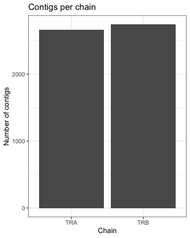
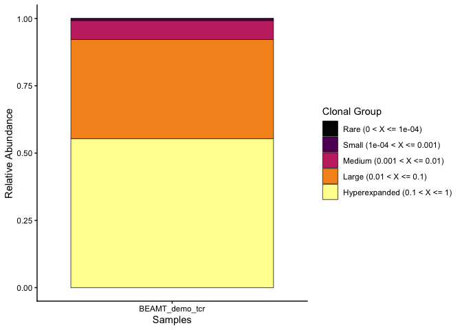
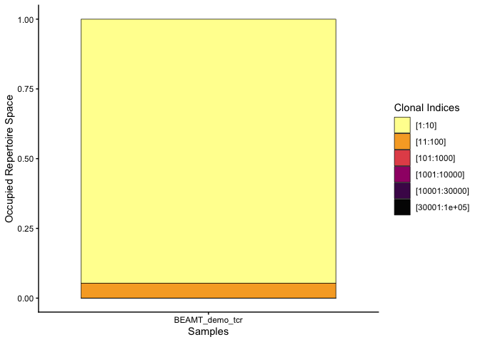
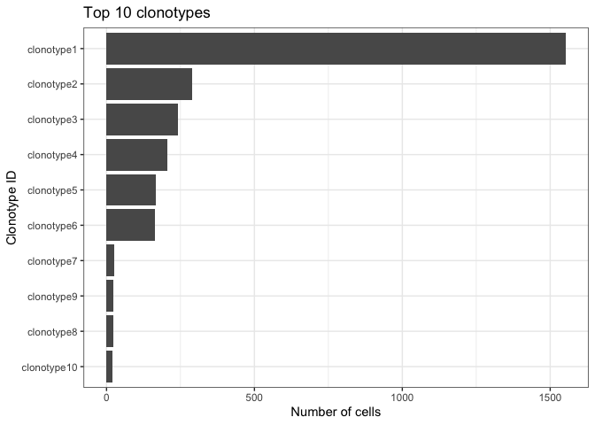
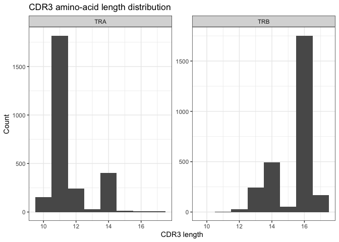
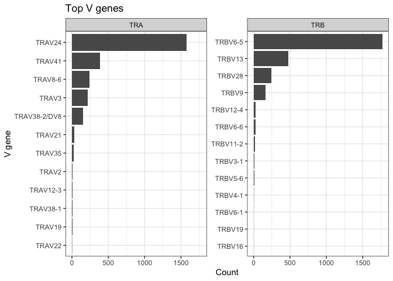
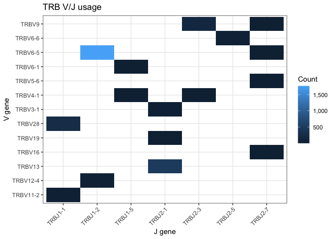
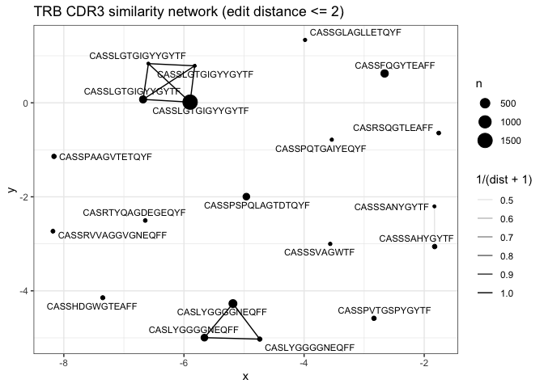

Single-cell TCR-seq data and epitope mapping
================
true
2026-04-19

- [1. Introduction](#1-introduction)
  - [Learning goals](#learning-goals)
  - [Input data](#input-data)
  - [Folder structure](#folder-structure)
  - [Load packages](#load-packages)
- [2. Read the TCR data](#2-read-the-tcr-data)
- [3. Contig summary](#3-contig-summary)
- [4. Keep productive TCR alpha/beta
  chains](#4-keep-productive-tcr-alphabeta-chains)
- [5. Build a clonotype object with
  scRepertoire](#5-build-a-clonotype-object-with-screpertoire)
- [6. Clonal expansion](#6-clonal-expansion)
- [7. Diversity metrics](#7-diversity-metrics)
- [8. Identify the most expanded
  clonotypes](#8-identify-the-most-expanded-clonotypes)
- [9. Explore CDR3 sequences](#9-explore-cdr3-sequences)
- [10. V and J gene usage](#10-v-and-j-gene-usage)
- [11. From clonotype to epitope: preparing candidate
  sequences](#11-from-clonotype-to-epitope-preparing-candidate-sequences)
- [12. Manual epitope mapping using public
  databases](#12-manual-epitope-mapping-using-public-databases)
- [13. Optional extension: sequence similarity
  network](#13-optional-extension-sequence-similarity-network)
- [Take-home message](#take-home-message)

# 1. Introduction

## Learning goals

By the end of this demo, you should be able to:\
1. read and inspect single-cell TCR sequencing output\
2. define and summarize clonotypes\
3. quantify clonal expansion and repertoire diversity\
4. visualize V/J gene usage and CDR3 properties\
5. connect TCR sequences to known epitopes using public resources

## Input data

This practical is built around a **public 10x Genomics BEAM-T dataset**
generated from human PBMCs. The dataset contains **gene expression and
VDJ-T libraries** from sorted CD8 T cells and includes two known peptide
specificities:\
- **Influenza (HLA-A*02:01): **`GILGFVFTL`\
-** CMV (HLA-B*07:02):** `TPRVTGGGAM`

Input dataset was download from the 10x Genomics dataset page
(<https://www.10xgenomics.com/datasets/5k-human-a0201-b0702-pbmcs-beam-t-2-standard>)
and place in current working directory called `demo_tcr/`. This demo
uses:\
- `filtered_contig_annotations.csv`

## Folder structure

``` text
DGP-485/
└── demo_tcr/
    ├── 20260420_DGP845.BCR_TCR_repertoire.Rmd
    └── filtered_contig_annotations.csv
```

## Load packages

``` r
suppressPackageStartupMessages(library(package = "knitr"))
suppressPackageStartupMessages(library(package = "scRepertoire"))
suppressPackageStartupMessages(library(package = "patchwork"))
suppressPackageStartupMessages(library(package = "scales"))
suppressPackageStartupMessages(library(package = "igraph"))
suppressPackageStartupMessages(library(package = "ggraph"))
suppressPackageStartupMessages(library(package = "tidyverse"))
```

# 2. Read the TCR data

``` r
contigsDF <- read.csv("filtered_contig_annotations.csv")
```

Print the header

``` r
head(contigsDF)
```

    ##              barcode is_cell                   contig_id high_confidence length
    ## 1 AAACCTGCAAGTCTAC-1    true AAACCTGCAAGTCTAC-1_contig_1            true    527
    ## 2 AAACCTGCAAGTCTAC-1    true AAACCTGCAAGTCTAC-1_contig_2            true    618
    ## 3 AAACCTGGTCTGATCA-1    true AAACCTGGTCTGATCA-1_contig_1            true    523
    ## 4 AAACCTGGTTAGGGTG-1    true AAACCTGGTTAGGGTG-1_contig_1            true    476
    ## 5 AAACCTGGTTAGGGTG-1    true AAACCTGGTTAGGGTG-1_contig_2            true    521
    ## 6 AAACCTGTCCACTGGG-1    true AAACCTGTCCACTGGG-1_contig_1            true    616
    ##   chain  v_gene d_gene  j_gene c_gene full_length productive
    ## 1   TRB  TRBV13  TRBD1 TRBJ2-1  TRBC2        true       true
    ## 2   TRA  TRAV41         TRAJ49   TRAC        true       true
    ## 3   TRB  TRBV13  TRBD1 TRBJ2-1  TRBC2        true       true
    ## 4   TRA  TRAV24         TRAJ49   TRAC        true       true
    ## 5   TRB TRBV6-5  TRBD1 TRBJ1-2  TRBC1        true       true
    ## 6   TRA  TRAV41         TRAJ49   TRAC        true       true
    ##                         fwr1
    ## 1 AAGVIQSPRHLIKEKRETATLKCYPI
    ## 2 KNEVEQSPQNLTAQEGEFITINCSYS
    ## 3 AAGVIQSPRHLIKEKRETATLKCYPI
    ## 4 ILNVEQSPQSLHVQEGDSTNFTCSFP
    ## 5 NAGVTQTPKFQVLKTGQSMTLQCAQD
    ## 6 KNEVEQSPQNLTAQEGEFITINCSYS
    ##                                                                          fwr1_nt
    ## 1 GCTGCTGGAGTCATCCAGTCCCCAAGACATCTGATCAAAGAAAAGAGGGAAACAGCCACTCTGAAATGCTATCCTATC
    ## 2 AAAAATGAAGTGGAGCAGAGTCCTCAGAACCTGACTGCCCAGGAAGGAGAATTTATCACAATCAACTGCAGTTACTCG
    ## 3 GCTGCTGGAGTCATCCAGTCCCCAAGACATCTGATCAAAGAAAAGAGGGAAACAGCCACTCTGAAATGCTATCCTATC
    ## 4 ATACTGAACGTGGAACAAAGTCCTCAGTCACTGCATGTTCAGGAGGGAGACAGCACCAATTTCACCTGCAGCTTCCCT
    ## 5 AATGCTGGTGTCACTCAGACCCCAAAATTCCAGGTCCTGAAGACAGGACAGAGCATGACACTGCAGTGTGCCCAGGAT
    ## 6 AAAAATGAAGTGGAGCAGAGTCCTCAGAACCTGACTGCCCAGGAAGGAGAATTTATCACAATCAACTGCAGTTACTCG
    ##     cdr1            cdr1_nt              fwr2
    ## 1  PRHDT    CCTAGACACGACACT VYWYQQGPGQDPQFLIS
    ## 2  VGISA    GTAGGAATAAGTGCC LHWLQQHPGGGIVSLFM
    ## 3  PRHDT    CCTAGACACGACACT VYWYQQGPGQDPQFLIS
    ## 4 SSNFYA TCCAGCAATTTTTATGCC LHWYRWETAKSPEALFV
    ## 5  MNHEY    ATGAACCATGAATAC MSWYRQDPGMGLRLIHY
    ## 6  VGISA    GTAGGAATAAGTGCC LHWLQQHPGGGIVSLFM
    ##                                               fwr2_nt    cdr2
    ## 1 GTCTACTGGTACCAGCAGGGTCCAGGTCAGGACCCCCAGTTCCTCATTTCG  FYEKMQ
    ## 2 TTACACTGGCTGCAACAGCATCCAGGAGGAGGCATTGTTTCCTTGTTTATG   LSSGK
    ## 3 GTCTACTGGTACCAGCAGGGTCCAGGTCAGGACCCCCAGTTCCTCATTTCG  FYEKMQ
    ## 4 TTACACTGGTACAGATGGGAAACTGCAAAAAGCCCCGAGGCCTTGTTTGTA MTLNGDE
    ## 5 ATGTCCTGGTATCGACAAGACCCAGGCATGGGGCTGAGGCTGATTCATTAC  SVGAGI
    ## 6 TTACACTGGCTGCAACAGCATCCAGGAGGAGGCATTGTTTCCTTGTTTATG   LSSGK
    ##                 cdr2_nt                                 fwr3
    ## 1    TTTTATGAAAAGATGCAG SDKGSIPDRFSAQQFSDYHSELNMSSLELGDSALYF
    ## 2       CTGAGCTCAGGGAAG    KKHGRLIATINIQEKHSSLHITASHPRDSAVYI
    ## 3    TTTTATGAAAAGATGCAG SDKGSIPDRFSAQQFSDYHSELNMSSLELGDSALYF
    ## 4 ATGACTTTAAATGGGGATGAA    KKKGRISATLNTKEGYSYLYIKGSQPEDSATYL
    ## 5    TCAGTTGGTGCTGGTATC TDQGEVPNGYNVSRSTTEDFPLRLLSAAPSQTSVYF
    ## 6       CTGAGCTCAGGGAAG    KKHGRLIATINIQEKHSSLHITASHPRDSAVYI
    ##                                                                                                        fwr3_nt
    ## 1 AGCGATAAAGGAAGCATCCCTGATCGATTCTCAGCTCAACAGTTCAGTGACTATCATTCTGAACTGAACATGAGCTCCTTGGAGCTGGGGGACTCAGCCCTGTACTTC
    ## 2          AAGAAGCATGGAAGATTAATTGCCACAATAAACATACAGGAAAAGCACAGCTCCCTGCACATCACAGCCTCCCATCCCAGAGACTCTGCCGTCTACATC
    ## 3 AGCGATAAAGGAAGCATCCCTGATCGATTCTCAGCTCAACAGTTCAGTGACTATCATTCTGAACTGAACATGAGCTCCTTGGAGCTGGGGGACTCAGCCCTGTACTTC
    ## 4          AAGAAGAAAGGACGAATAAGTGCCACTCTTAATACCAAGGAGGGTTACAGCTATTTGTACATCAAAGGATCCCAGCCTGAAGACTCAGCCACATACCTC
    ## 5 ACTGACCAAGGAGAAGTCCCCAATGGCTACAATGTCTCCAGATCAACCACAGAGGATTTCCCGCTCAGGCTGCTGTCGGCTGCTCCCTCCCAGACATCTGTGTACTTC
    ## 6          AAGAAGCATGGAAGATTAATTGCCACAATAAACATACAGGAAAAGCACAGCTCCCTGCACATCACAGCCTCCCATCCCAGAGACTCTGCCGTCTACATC
    ##               cdr3                                          cdr3_nt       fwr4
    ## 1   CASLYGGGGNEQFF       TGTGCCAGCCTATACGGGGGAGGGGGCAATGAGCAGTTCTTC  GPGTRLTVL
    ## 2   CAADDTNTGNQFYF       TGTGCTGCCGACGATACGAACACCGGTAACCAGTTCTATTTT GTGTSLTVIP
    ## 3   CASLYGGGGNEQFF       TGTGCCAGCCTATACGGGGGAGGGGGCAATGAGCAGTTCTTC  GPGTRLTVL
    ## 4      CARNTGNQFYF                TGTGCCCGGAACACCGGTAACCAGTTCTATTTT GTGTSLTVIP
    ## 5 CASSLGTGIGYYGYTF TGTGCCAGCAGTCTAGGGACAGGGATCGGCTACTATGGCTACACCTTC  GSGTRLTVV
    ## 6   CAADDTNTGNQFYF       TGTGCTGCCGACGATACGAACACCGGTAACCAGTTCTATTTT GTGTSLTVIP
    ##                           fwr4_nt reads umis raw_clonotype_id
    ## 1    GGGCCAGGGACACGGCTCACCGTGCTAG 13404   36       clonotype5
    ## 2 GGGACAGGGACAAGTTTGACGGTCATTCCAA  1316   11       clonotype5
    ## 3    GGGCCAGGGACACGGCTCACCGTGCTAG  1578    6       clonotype2
    ## 4 GGGACAGGGACAAGTTTGACGGTCATTCCAA   573    4       clonotype1
    ## 5    GGTTCGGGGACCAGGTTAACCGTTGTAG  3655   12       clonotype1
    ## 6 GGGACAGGGACAAGTTTGACGGTCATTCCAA   854    6       clonotype2
    ##         raw_consensus_id exact_subclonotype_id
    ## 1 clonotype5_consensus_1                     1
    ## 2 clonotype5_consensus_2                     1
    ## 3 clonotype2_consensus_1                     4
    ## 4 clonotype1_consensus_2                     1
    ## 5 clonotype1_consensus_1                     1
    ## 6 clonotype2_consensus_2                     1

# 3. Contig summary

Summarize the structure of the repertoire

``` r
contigsDF %>%
  summarize(n_rows       = n(),
            n_cells      = n_distinct(barcode),
            n_productive = sum(as.logical(productive), na.rm = TRUE),
            chains       = paste(sort(unique(chain)), collapse = ","),
            .groups      = "drop")
```

    ##   n_rows n_cells n_productive  chains
    ## 1   5409    2771         5409 TRA,TRB

Count the number of contigs per chain.

``` r
contigsDF %>%
  count(chain, sort = TRUE)
```

    ##   chain    n
    ## 1   TRB 2742
    ## 2   TRA 2667

Plot chain composition.

``` r
contigsDF %>%
  count(chain, sort = TRUE) %>%
  ggplot(aes(x = reorder(chain, n), y = n)) +
  geom_col() +
  labs(title = "Contigs per chain", x = "Chain", y = "Number of contigs") +
  theme_bw()
```

<!-- -->

# 4. Keep productive TCR alpha/beta chains

Check whether cells have paired alpha and beta chains.

``` r
pairedStatusDF <- contigsDF %>%
  distinct(barcode, chain) %>%
  count(barcode, chain) %>%
  pivot_wider(names_from = chain, values_from = n, values_fill = 0) %>%
  mutate(paired_ab = `TRA` > 0 & `TRB` > 0,
         tra_only  = `TRA` > 0 & `TRB` == 0,
         trb_only  = `TRB` > 0 & `TRA` == 0)

pairedStatusDF %>%
  summarize(total_cells = n(),
            paired_ab   = sum(paired_ab),
            tra_only    = sum(tra_only),
            trb_only    = sum(trb_only),
            .groups     = "drop")
```

    ## # A tibble: 1 × 4
    ##   total_cells paired_ab tra_only trb_only
    ##         <int>     <int>    <int>    <int>
    ## 1        2771      2409       31      331

# 5. Build a clonotype object with scRepertoire

`scRepertoire` is widely used in teaching because it provides simple
functions for clonal frequency, diversity, and repertoire visualization.

``` r
combinedLS <- combineTCR(
  input.data = list(contigsDF),
  samples = "BEAMT",
  ID = "demo_tcr")
```

Inspect the object.

``` r
str(combinedLS, max.level = 1)
```

    ## List of 1
    ##  $ BEAMT_demo_tcr:'data.frame':  2771 obs. of  13 variables:

``` r
head(combinedLS[[1]])
```

    ##                              barcode sample       ID
    ## 1  BEAMT_demo_tcr_AAACCTGCAAGTCTAC-1  BEAMT demo_tcr
    ## 3  BEAMT_demo_tcr_AAACCTGGTCTGATCA-1  BEAMT demo_tcr
    ## 4  BEAMT_demo_tcr_AAACCTGGTTAGGGTG-1  BEAMT demo_tcr
    ## 6  BEAMT_demo_tcr_AAACCTGTCCACTGGG-1  BEAMT demo_tcr
    ## 9  BEAMT_demo_tcr_AAACCTGTCCCATTTA-1  BEAMT demo_tcr
    ## 11 BEAMT_demo_tcr_AAACCTGTCGGGAGTA-1  BEAMT demo_tcr
    ##                                      TCR1                    cdr3_aa1
    ## 1                      TRAV41.TRAJ49.TRAC              CAADDTNTGNQFYF
    ## 3                                    <NA>                        <NA>
    ## 4                      TRAV24.TRAJ49.TRAC                 CARNTGNQFYF
    ## 6  TRAV41.TRAJ49.TRAC;TRAV8-6.TRAJ48.TRAC CAADDTNTGNQFYF;CAVSAINEKLTF
    ## 9                      TRAV24.TRAJ49.TRAC                 CARNTGNQFYF
    ## 11                     TRAV24.TRAJ49.TRAC                 CARNTGNQFYF
    ##                                                                           cdr3_nt1
    ## 1                                       TGTGCTGCCGACGATACGAACACCGGTAACCAGTTCTATTTT
    ## 3                                                                             <NA>
    ## 4                                                TGTGCCCGGAACACCGGTAACCAGTTCTATTTT
    ## 6  TGTGCTGCCGACGATACGAACACCGGTAACCAGTTCTATTTT;TGTGCTGTGAGTGCTATAAATGAGAAATTAACCTTT
    ## 9                                                TGTGCCCGGAACACCGGTAACCAGTTCTATTTT
    ## 11                                               TGTGCCCGGAACACCGGTAACCAGTTCTATTTT
    ##                           TCR2         cdr3_aa2
    ## 1   TRBV13.TRBD1.TRBJ2-1.TRBC2   CASLYGGGGNEQFF
    ## 3   TRBV13.TRBD1.TRBJ2-1.TRBC2   CASLYGGGGNEQFF
    ## 4  TRBV6-5.TRBD1.TRBJ1-2.TRBC1 CASSLGTGIGYYGYTF
    ## 6   TRBV13.TRBD1.TRBJ2-1.TRBC2   CASLYGGGGNEQFF
    ## 9  TRBV6-5.TRBD1.TRBJ1-2.TRBC1 CASSLGTGIGYYGYTF
    ## 11 TRBV6-5.TRBD1.TRBJ1-2.TRBC1 CASSLGTGIGYYGYTF
    ##                                            cdr3_nt2
    ## 1        TGTGCCAGCCTATACGGGGGAGGGGGCAATGAGCAGTTCTTC
    ## 3        TGTGCCAGCCTATACGGGGGAGGGGGCAATGAGCAGTTCTTC
    ## 4  TGTGCCAGCAGTCTAGGGACAGGGATCGGCTACTATGGCTACACCTTC
    ## 6        TGTGCCAGCCTATACGGGGGAGGGGGCAATGAGCAGTTCTTC
    ## 9  TGTGCCAGCAGTCTAGGGACAGGGATCGGCTACTATGGCTACACCTTC
    ## 11 TGTGCCAGCAGTCTAGGGACAGGGATCGGCTACTATGGCTACACCTTC
    ##                                                               CTgene
    ## 1                      TRAV41.TRAJ49.TRAC_TRBV13.TRBD1.TRBJ2-1.TRBC2
    ## 3                                      NA_TRBV13.TRBD1.TRBJ2-1.TRBC2
    ## 4                     TRAV24.TRAJ49.TRAC_TRBV6-5.TRBD1.TRBJ1-2.TRBC1
    ## 6  TRAV41.TRAJ49.TRAC;TRAV8-6.TRAJ48.TRAC_TRBV13.TRBD1.TRBJ2-1.TRBC2
    ## 9                     TRAV24.TRAJ49.TRAC_TRBV6-5.TRBD1.TRBJ1-2.TRBC1
    ## 11                    TRAV24.TRAJ49.TRAC_TRBV6-5.TRBD1.TRBJ1-2.TRBC1
    ##                                                                                                                          CTnt
    ## 1                                       TGTGCTGCCGACGATACGAACACCGGTAACCAGTTCTATTTT_TGTGCCAGCCTATACGGGGGAGGGGGCAATGAGCAGTTCTTC
    ## 3                                                                               NA_TGTGCCAGCCTATACGGGGGAGGGGGCAATGAGCAGTTCTTC
    ## 4                                          TGTGCCCGGAACACCGGTAACCAGTTCTATTTT_TGTGCCAGCAGTCTAGGGACAGGGATCGGCTACTATGGCTACACCTTC
    ## 6  TGTGCTGCCGACGATACGAACACCGGTAACCAGTTCTATTTT;TGTGCTGTGAGTGCTATAAATGAGAAATTAACCTTT_TGTGCCAGCCTATACGGGGGAGGGGGCAATGAGCAGTTCTTC
    ## 9                                          TGTGCCCGGAACACCGGTAACCAGTTCTATTTT_TGTGCCAGCAGTCTAGGGACAGGGATCGGCTACTATGGCTACACCTTC
    ## 11                                         TGTGCCCGGAACACCGGTAACCAGTTCTATTTT_TGTGCCAGCAGTCTAGGGACAGGGATCGGCTACTATGGCTACACCTTC
    ##                                          CTaa
    ## 1               CAADDTNTGNQFYF_CASLYGGGGNEQFF
    ## 3                           NA_CASLYGGGGNEQFF
    ## 4                CARNTGNQFYF_CASSLGTGIGYYGYTF
    ## 6  CAADDTNTGNQFYF;CAVSAINEKLTF_CASLYGGGGNEQFF
    ## 9                CARNTGNQFYF_CASSLGTGIGYYGYTF
    ## 11               CARNTGNQFYF_CASSLGTGIGYYGYTF
    ##                                                                                                                                                                                        CTstrict
    ## 1                                                           TRAV41.TRAJ49.TRAC;TGTGCTGCCGACGATACGAACACCGGTAACCAGTTCTATTTT_TRBV13.TRBD1.TRBJ2-1.TRBC2;TGTGCCAGCCTATACGGGGGAGGGGGCAATGAGCAGTTCTTC
    ## 3                                                                                                                   NA;NA_TRBV13.TRBD1.TRBJ2-1.TRBC2;TGTGCCAGCCTATACGGGGGAGGGGGCAATGAGCAGTTCTTC
    ## 4                                                             TRAV24.TRAJ49.TRAC;TGTGCCCGGAACACCGGTAACCAGTTCTATTTT_TRBV6-5.TRBD1.TRBJ1-2.TRBC1;TGTGCCAGCAGTCTAGGGACAGGGATCGGCTACTATGGCTACACCTTC
    ## 6  TRAV41.TRAJ49.TRAC;TRAV8-6.TRAJ48.TRAC;TGTGCTGCCGACGATACGAACACCGGTAACCAGTTCTATTTT;TGTGCTGTGAGTGCTATAAATGAGAAATTAACCTTT_TRBV13.TRBD1.TRBJ2-1.TRBC2;TGTGCCAGCCTATACGGGGGAGGGGGCAATGAGCAGTTCTTC
    ## 9                                                             TRAV24.TRAJ49.TRAC;TGTGCCCGGAACACCGGTAACCAGTTCTATTTT_TRBV6-5.TRBD1.TRBJ1-2.TRBC1;TGTGCCAGCAGTCTAGGGACAGGGATCGGCTACTATGGCTACACCTTC
    ## 11                                                            TRAV24.TRAJ49.TRAC;TGTGCCCGGAACACCGGTAACCAGTTCTATTTT_TRBV6-5.TRBD1.TRBJ1-2.TRBC1;TGTGCCAGCAGTCTAGGGACAGGGATCGGCTACTATGGCTACACCTTC

# 6. Clonal expansion

A central question in repertoire analysis is whether a small number of
clonotypes dominate the sample.

``` r
clonalHomeostasis(combinedLS, cloneCall = "aa")
```

<!-- -->

``` r
clonalProportion(combinedLS, cloneCall = "aa")
```

<!-- -->
Questions: - Is the repertoire evenly distributed?\
- Do you see evidence for large expanded clones?\
- What biological processes can generate expansion of a clone?

# 7. Diversity metrics

Diversity is not the same thing as the number of cells. It reflects both
the **number of distinct clonotypes** and **how evenly they are
represented**.

``` r
clonalDiverityPlot <- clonalDiversity(combinedLS, cloneCall = "aa")
clonalDiverityPlot@data
```

    ##            Group x.axis     variable        value
    ## 1 BEAMT_demo_tcr      1      shannon    1.7698932
    ## 2 BEAMT_demo_tcr      1  inv.simpson    3.0197591
    ## 3 BEAMT_demo_tcr      1 norm.entropy    0.4677073
    ## 4 BEAMT_demo_tcr      1 gini.simpson    0.6688478
    ## 5 BEAMT_demo_tcr      1        chao1   74.0000000
    ## 6 BEAMT_demo_tcr      1          ACE -194.8194159

Which metric would decrease most if one clone became extremely dominant?

# 8. Identify the most expanded clonotypes

Compute the most frequent paired clonotypes directly from the contig
table.

``` r
topClonesDF <- contigsDF %>%
  filter(!is.na(raw_clonotype_id), raw_clonotype_id != "") %>%
  distinct(barcode, raw_clonotype_id) %>%
  count(raw_clonotype_id, sort = TRUE) %>%
  slice_head(n = 10)

topClonesDF
```

    ##    raw_clonotype_id    n
    ## 1        clonotype1 1552
    ## 2        clonotype2  288
    ## 3        clonotype3  243
    ## 4        clonotype4  206
    ## 5        clonotype5  166
    ## 6        clonotype6  163
    ## 7        clonotype7   26
    ## 8        clonotype8   24
    ## 9        clonotype9   24
    ## 10      clonotype10   21

Visualize the top clonotypes.

``` r
ggplot(data    = topClonesDF,
       mapping = aes(x = reorder(raw_clonotype_id, n), y = n)) +
  geom_col() +
  coord_flip() +
  labs(title = "Top 10 clonotypes",
       x     = "Clonotype ID",
       y     = "Number of cells") +
  theme_bw()
```

<!-- -->

# 9. Explore CDR3 sequences

The CDR3 region is the most variable part of the receptor and is usually
the main sequence used for specificity-oriented analyses.

``` r
cdr3TableDF <- contigsDF %>%
  select(barcode, chain, v_gene, j_gene, cdr3, raw_clonotype_id) %>%
  distinct()

head(cdr3TableDF)
```

    ##              barcode chain  v_gene  j_gene             cdr3 raw_clonotype_id
    ## 1 AAACCTGCAAGTCTAC-1   TRB  TRBV13 TRBJ2-1   CASLYGGGGNEQFF       clonotype5
    ## 2 AAACCTGCAAGTCTAC-1   TRA  TRAV41  TRAJ49   CAADDTNTGNQFYF       clonotype5
    ## 3 AAACCTGGTCTGATCA-1   TRB  TRBV13 TRBJ2-1   CASLYGGGGNEQFF       clonotype2
    ## 4 AAACCTGGTTAGGGTG-1   TRA  TRAV24  TRAJ49      CARNTGNQFYF       clonotype1
    ## 5 AAACCTGGTTAGGGTG-1   TRB TRBV6-5 TRBJ1-2 CASSLGTGIGYYGYTF       clonotype1
    ## 6 AAACCTGTCCACTGGG-1   TRA  TRAV41  TRAJ49   CAADDTNTGNQFYF       clonotype2

Plot CDR3 length distributions.

``` r
cdr3LengthsDF <- cdr3TableDF %>%
  filter(!is.na(cdr3), cdr3 != "") %>%
  mutate(cdr3_length = nchar(cdr3))

ggplot(data = cdr3LengthsDF, mapping = aes(x = cdr3_length)) +
  geom_histogram(binwidth = 1) +
  facet_wrap(~chain, scales = "free_y") +
  labs(title = "CDR3 amino-acid length distribution", 
       x     = "CDR3 length", 
      y      = "Count") +
  theme_bw()
```

<!-- -->
Do TRA and TRB CDR3 lengths appear similar? Why might they differ?

# 10. V and J gene usage

V and J usage can reflect both recombination biases and antigen-driven
selection.

``` r
vUsageDF <- cdr3TableDF %>%
  count(chain, v_gene, sort = TRUE) %>%
  group_by(chain) %>%
  slice_max(n, n = 12) %>%
  ungroup()

vUsageDF
```

    ## # A tibble: 25 × 3
    ##    chain v_gene           n
    ##    <chr> <chr>        <int>
    ##  1 TRA   TRAV24        1580
    ##  2 TRA   TRAV41         384
    ##  3 TRA   TRAV8-6        239
    ##  4 TRA   TRAV3          221
    ##  5 TRA   TRAV38-2/DV8   153
    ##  6 TRA   TRAV21          31
    ##  7 TRA   TRAV35          21
    ##  8 TRA   TRAV2           11
    ##  9 TRA   TRAV12-3         7
    ## 10 TRA   TRAV19           6
    ## # ℹ 15 more rows

``` r
ggplot(data = vUsageDF, mapping = aes(x = reorder(v_gene, n), y = n)) +
  geom_col() +
  coord_flip() +
  facet_wrap(~chain, scales = "free_y") +
  labs(title = "Top V genes", x = "V gene", y = "Count") +
  theme_bw()
```

<!-- -->

Now examine V/J combinations.

``` r
vjUsageDF <- cdr3TableDF %>%
  filter(chain == "TRB", !is.na(v_gene), !is.na(j_gene)) %>%
  count(v_gene, j_gene)

ggplot(data = vjUsageDF, mapping = aes(x = j_gene, y = v_gene, fill = n)) +
  geom_tile() +
  scale_fill_continuous(labels = comma) +
  labs(title = "TRB V/J usage", x = "J gene", y = "V gene", fill = "Count") +
  theme_bw() + 
  theme(axis.text.x = element_text(angle = 45, hjust = 1))
```

<!-- -->

# 11. From clonotype to epitope: preparing candidate sequences

For epitope mapping, a common starting point is to inspect the most
expanded TCRs, especially the **TRB CDR3 amino-acid sequences**.

``` r
topTrbCdr3DF <- contigsDF %>%
  filter(chain == "TRB", !is.na(cdr3), cdr3 != "") %>%
  distinct(barcode, raw_clonotype_id, cdr3, v_gene, j_gene) %>%
  count(raw_clonotype_id, cdr3, v_gene, j_gene, sort = TRUE) %>%
  slice_head(n = 20)

topTrbCdr3DF
```

    ##    raw_clonotype_id              cdr3   v_gene  j_gene    n
    ## 1        clonotype1  CASSLGTGIGYYGYTF  TRBV6-5 TRBJ1-2 1533
    ## 2        clonotype2    CASLYGGGGNEQFF   TRBV13 TRBJ2-1  288
    ## 3        clonotype3     CASSFQGYTEAFF   TRBV28 TRBJ1-1  236
    ## 4        clonotype4  CASSLGTGIGYYGYTF  TRBV6-5 TRBJ1-2  206
    ## 5        clonotype5    CASLYGGGGNEQFF   TRBV13 TRBJ2-1  166
    ## 6        clonotype6 CASSPSPQLAGTDTQYF    TRBV9 TRBJ2-3  159
    ## 7        clonotype7      CASSSAHYGYTF TRBV12-4 TRBJ1-2   25
    ## 8        clonotype8   CASSPAAGVTETQYF  TRBV6-6 TRBJ2-5   24
    ## 9        clonotype9   CASSPVTGSPYGYTF  TRBV6-5 TRBJ1-2   24
    ## 10      clonotype10    CASLYGGGGNEQFF   TRBV13 TRBJ2-1   21
    ## 11      clonotype11    CASSHDGWGTEAFF TRBV11-2 TRBJ1-1   15
    ## 12      clonotype12 CASSRVVAGGVGNEQFF  TRBV3-1 TRBJ2-1    9
    ## 13      clonotype13     CASRSQGTLEAFF   TRBV28 TRBJ1-1    8
    ## 14      clonotype14  CASRTYQAGDEGEQYF  TRBV5-6 TRBJ2-7    6
    ## 15      clonotype15       CASSSVAGWTF TRBV12-4 TRBJ1-2    3
    ## 16      clonotype16   CASSPQTGAIYEQYF  TRBV6-5 TRBJ2-7    2
    ## 17      clonotype17   CASSGLAGLLETQYF  TRBV6-6 TRBJ2-5    2
    ## 18      clonotype16  CASSLGTGIGYYGYTF  TRBV6-5 TRBJ1-2    1
    ## 19      clonotype18      CASSSANYGYTF TRBV12-4 TRBJ1-2    1
    ## 20      clonotype19  CASSLGTGIGYYGYTF  TRBV6-5 TRBJ1-2    1

Export a short list for manual database interrogation.

``` r
write_csv(topTrbCdr3DF, file = "top_TRB_CDR3_for_epitope_search.csv")
```

# 12. Manual epitope mapping using public databases

Use the table above and query the following public resources: **IEDB**
(<https://tools.iedb.org/tcrmatch/result/>)

For each of the top 5 TRB CDR3 sequences, record: 1. whether an exact or
near match exists; 2. the reported antigen / epitope; 3. the HLA
restriction; 4. the pathogen or disease context.

``` r
iedbRes <- read_tsv(file = "tcrmatch_result_8381De.tsv")
```

    ## Rows: 1724 Columns: 7
    ## ── Column specification ─────────────────────────────────
    ## Delimiter: "\t"
    ## chr (5): trimmed_input_sequence, match_sequence, epitope, antigen, organism
    ## dbl (2): score, receptor_group
    ## 
    ## ℹ Use `spec()` to retrieve the full column specification for this data.
    ## ℹ Specify the column types or set `show_col_types = FALSE` to quiet this message.

``` r
iedbRes %>% filter(grepl(pattern = "GILGFVFTL", epitope)) %>%
  arrange(desc(score))
```

    ## # A tibble: 139 × 7
    ##    trimmed_input_sequence match_sequence score receptor_group epitope    antigen
    ##    <chr>                  <chr>          <dbl>          <dbl> <chr>      <chr>  
    ##  1 ASSSANYGYT             ASSSANYGYT     1              34645 NLVPMVATV… HCMVUL…
    ##  2 ASSSAHYGYT             ASSSANYGYT     0.955          34645 NLVPMVATV… HCMVUL…
    ##  3 ASSSANYGYT             ASSDSNYGYT     0.949          80577 GILGFVFTL… Matrix…
    ##  4 ASSSANYGYT             ASSTGNYGYT     0.947          17002 GILGFVFTL… Matrix…
    ##  5 ASSSANYGYT             ASSSGSYGYT     0.946          57072 GILGFVFTL… Matrix…
    ##  6 ASSSANYGYT             ASSSGTYGYT     0.939          17392 GILGFVFTL… Matrix…
    ##  7 ASSSANYGYT             ASSSGAYGYT     0.938          15743 GILGFVFTL  Matrix…
    ##  8 ASSSANYGYT             ASSAGSYGYT     0.937          39285 GILGFVFTL… Matrix…
    ##  9 ASSSANYGYT             ASSQGNYGYT     0.934         199327 GILGFVFTL… Matrix…
    ## 10 ASSSANYGYT             ASSTGSYGYT     0.933         188816 GILGFVFTL… Matrix…
    ## # ℹ 129 more rows
    ## # ℹ 1 more variable: organism <chr>

``` r
filter(topTrbCdr3DF, grepl(pattern = "ASSSANYGYT", cdr3))
```

    ##   raw_clonotype_id         cdr3   v_gene  j_gene n
    ## 1      clonotype18 CASSSANYGYTF TRBV12-4 TRBJ1-2 1

``` r
iedbRes %>% filter(grepl(pattern = "TPRVTGGGAM", epitope)) %>%
  arrange(desc(score))
```

    ## # A tibble: 21 × 7
    ##    trimmed_input_sequence match_sequence score receptor_group epitope    antigen
    ##    <chr>                  <chr>          <dbl>          <dbl> <chr>      <chr>  
    ##  1 ASSGLAGLLETQY          ASSSLAGVLETQY  0.948          22512 LPRRSGAAG… nucleo…
    ##  2 ASLYGGGGNEQF           ASSYGGGGDEQF   0.936          23209 LPRRSGAAG… nucleo…
    ##  3 ASLYGGGGNEQF           ASSYGGGGDEQF   0.936          23209 LPRRSGAAG… nucleo…
    ##  4 ASLYGGGGNEQF           ASSYGGGGDEQF   0.936          23209 LPRRSGAAG… nucleo…
    ##  5 ASSSANYGYT             ASSSGYGYT      0.930          22501 LPRRSGAAG… nucleo…
    ##  6 ASSSANYGYT             ASSSGQNYGYT    0.924          22418 LLLDRLNQL… Nucleo…
    ##  7 ASSSAHYGYT             ASSSGYGYT      0.917          22501 LPRRSGAAG… nucleo…
    ##  8 ASLYGGGGNEQF           ASSYGGGGYEQF   0.915          21218 LPRRSGAAG… nucleo…
    ##  9 ASLYGGGGNEQF           ASSYGGGGYEQF   0.915          21218 LPRRSGAAG… nucleo…
    ## 10 ASLYGGGGNEQF           ASSYGGGGYEQF   0.915          21218 LPRRSGAAG… nucleo…
    ## # ℹ 11 more rows
    ## # ℹ 1 more variable: organism <chr>

``` r
filter(topTrbCdr3DF, grepl(pattern = "ASSGLAGLLETQY", cdr3))
```

    ##   raw_clonotype_id            cdr3  v_gene  j_gene n
    ## 1      clonotype17 CASSGLAGLLETQYF TRBV6-6 TRBJ2-5 2

Do any of your top clonotypes map to influenza or CMV-associated
receptors? If not, what are the possible explanations?

# 13. Optional extension: sequence similarity network

A simple way to introduce the idea of receptor similarity is to connect
TRB CDR3s that differ by only a small edit distance. \> This is **not**
a full specificity model, but it provides intuition for motif clustering
methods such as GLIPH2 or TCRdist.

``` r
smallSetDF <- topTrbCdr3DF %>%
  slice_head(n = 20) %>%
  mutate(node_id = row_number())

edgesDF <- expand.grid(i = smallSetDF$node_id, j = smallSetDF$node_id) %>%
  as_tibble() %>%
  filter(i < j) %>%
  left_join(smallSetDF %>% select(i = node_id, cdr3_i = cdr3), by = "i") %>%
  left_join(smallSetDF %>% select(j = node_id, cdr3_j = cdr3), by = "j") %>%
  mutate(dist = mapply(adist, cdr3_i, cdr3_j)) %>%
  filter(dist <= 2)

edgesDF
```

    ## # A tibble: 10 × 5
    ##        i     j cdr3_i           cdr3_j            dist
    ##    <int> <int> <chr>            <chr>            <dbl>
    ##  1     1     4 CASSLGTGIGYYGYTF CASSLGTGIGYYGYTF     0
    ##  2     2     5 CASLYGGGGNEQFF   CASLYGGGGNEQFF       0
    ##  3     2    10 CASLYGGGGNEQFF   CASLYGGGGNEQFF       0
    ##  4     5    10 CASLYGGGGNEQFF   CASLYGGGGNEQFF       0
    ##  5     1    18 CASSLGTGIGYYGYTF CASSLGTGIGYYGYTF     0
    ##  6     4    18 CASSLGTGIGYYGYTF CASSLGTGIGYYGYTF     0
    ##  7     7    19 CASSSAHYGYTF     CASSSANYGYTF         1
    ##  8     1    20 CASSLGTGIGYYGYTF CASSLGTGIGYYGYTF     0
    ##  9     4    20 CASSLGTGIGYYGYTF CASSLGTGIGYYGYTF     0
    ## 10    18    20 CASSLGTGIGYYGYTF CASSLGTGIGYYGYTF     0

``` r
if (nrow(edgesDF) > 0) {
  g <- graph_from_data_frame(
    d = edgesDF %>% select(i, j, dist),
    directed = FALSE,
    vertices = smallSetDF %>% select(node_id, cdr3, n)
  )

ggraph(g, layout = "fr") +
    geom_edge_link(aes(alpha = 1 / (dist + 1))) +
    geom_node_point(aes(size = n)) +
    geom_node_text(aes(label = cdr3), repel = TRUE, size = 3) +
    labs(title = "TRB CDR3 similarity network (edit distance <= 2)") +
    theme_bw()
} else {
  cat("No edges found at edit distance <= 2 in this subset. Try a larger threshold.\n")
}
```

<!-- -->

# Take-home message

TCR repertoire analysis is one of the clearest examples of how
sequencing, statistics, and immunology intersect. In a single workflow,
students can move from: - raw VDJ output, - to clonotype structure, - to
diversity and expansion, - to hypotheses about antigen specificity.
